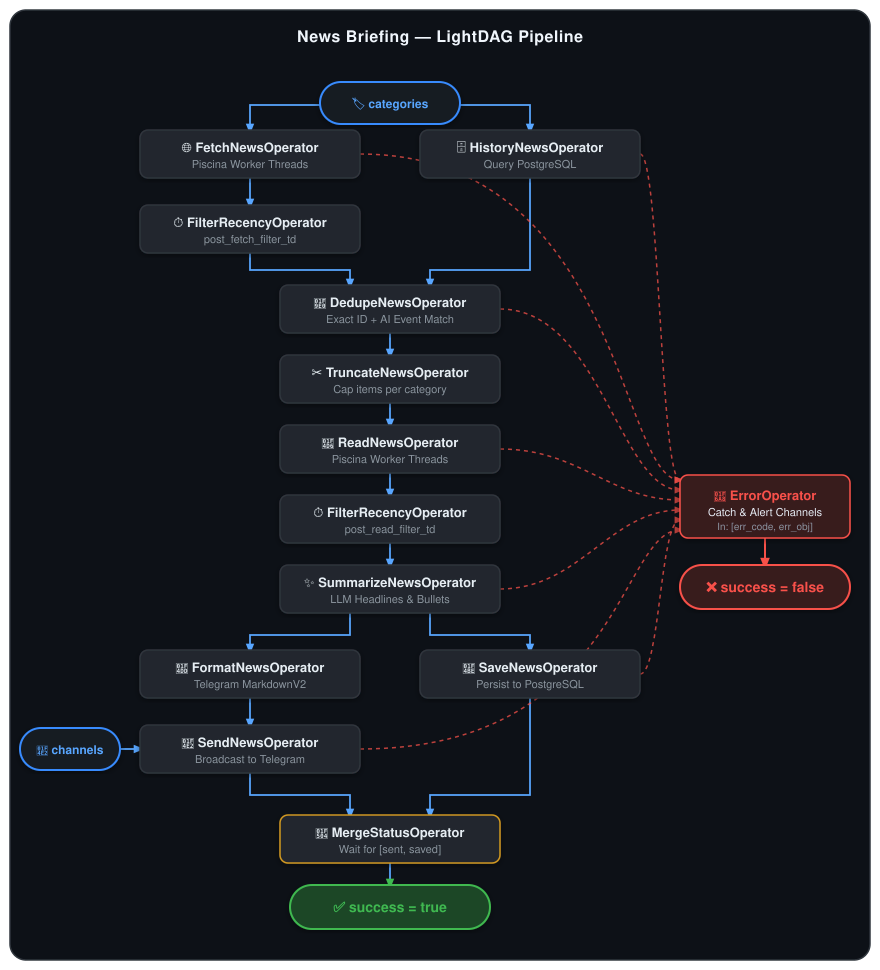

# News Briefing

An automated, AI-powered news briefing and summarization pipeline built with TypeScript and Node.js. 

It periodically gathers news across multiple categories, filters fresh stories, deduplicates against past coverage using AI, extracts article contents in parallel worker threads, synthesizes high-quality summaries with LLMs, and broadcasts formatted digests directly to Telegram channels.

## Architecture & Features

The pipeline is orchestrated by a lightweight Directed Acyclic Graph (**LightDAG**) engine where each step is an isolated, strongly-typed **Operator**.

<p align="center">
  
</p>

- **Multi-Category Ingestion & Smart Filtering:** Supported categories include `international`, `football`, `realmadrid`, `f1`, `ai`, `mlb`, `shenzhen`, and `tabletennis`. Automatically filters out paywalled/anti-bot domains during feed parsing.
- **Two-Stage Intelligent Truncation:** Applies random truncation pre-read (`pre_read_truncate_news`) to minimize scraping load and post-summarize (`post_summarize_truncate_news`) to constrain the final digest length per category.
- **True Parallel Processing:** Uses [Piscina](https://github.com/piscinajs/piscina) worker threads for CPU and I/O intensive web scraping (`fetch` and `read`) off the main event loop, equipped with modern browser header emulation.
- **Two-Stage Smart Deduplication:** Combines exact PostgreSQL historical hash filtering with LLM semantic event matching (`DedupeNewsOperator`) protected by automated JSON repair to track development stages and eliminate redundant coverage.
- **Multilingual AI Summarization:** Generates concise, journalistic headlines and substantive bullet points in your selected language (`SummarizeNewsOperator`), reinforced with strict content quality filtering, configurable bullet counts and character lengths (`summarize_min_bullets`/`summarize_max_bullets`, `summarize_min_chars`/`summarize_max_chars`), schema formatting, and quote escaping rules. Supports multiple AI providers (`openai`, `anthropic`, `openai-compatible`).
- **Telegram Delivery & Dual Persistence:** Formats messages into clean Telegram `MarkdownV2` syntax with auto-chunking (`FormatNewsOperatorThread` ➔ `SendNewsOperator`) while simultaneously persisting news to PostgreSQL (`SaveNewsOperator`), converging at `MergeStatusOperator`.
- **Scheduled or One-Off Execution:** Run once directly via CLI or continuously as a background service via integrated Cron scheduling.
- **Fault-Tolerant Error Handling:** Catches and isolates errors at each DAG node, routing failures to `ErrorOperator` to alert designated Telegram error channels without silent failures.


## Quick Start

Deploy and run the full stack (App + PostgreSQL) in minutes using Docker Compose.

### 1. Clone & Configure

```bash
git clone <repo-url>
cd news_briefing
cp src/.env .env
```

Edit `.env` with your credentials and preferences:

| Variable | Required | Default | Description |
| :--- | :---: | :---: | :--- |
| `database_host` | Yes | `news_db` | PostgreSQL host (`news_db` for Docker) |
| `database_port` | No | `5432` | PostgreSQL port |
| `database_user` | Yes | — | PostgreSQL username |
| `database_password` | Yes | — | PostgreSQL password |
| `database_name` | Yes | — | PostgreSQL database name |
| `ai_api_key` | Yes | — | API key for OpenAI, Anthropic, or OpenAI-compatible provider |
| `ai_base_url` | Yes | — | Base URL for LLM provider (e.g. `https://api.openai.com/v1`) |
| `ai_model` | Yes | — | Model identifier (e.g. `gpt-4o-mini`, `gpt-5.6-luna`, `claude-3-5-sonnet`) |
| `ai_provider_type` | Yes | — | Provider engine: `openai`, `anthropic`, `openai-compatible` |
| `ai_reasoning_effort` | No | `medium` | Reasoning effort for reasoning models: `low`, `medium`, `high`, `xhigh`, `max` |
| `ai_timeout` | No | `300000` | AI request timeout in milliseconds |
| `ai_max_retries` | No | `3` | AI request retry count |
| `telegram_token` | Yes | — | Telegram Bot token from [@BotFather](https://t.me/botfather) |
| `categories` | Yes | — | Comma-separated categories: `international, football, realmadrid, f1, ai, mlb, shenzhen, tabletennis` |
| `channels` | Yes | — | Comma-separated target Telegram chat/channel IDs |
| `language` | No | `English` | Output language: `English`, `Chinese`, `Spanish`, `French`, `German`, `Italian`, `Portuguese`, `Russian`, `Japanese`, `Korean` |
| `summarize_min_chars` | Yes | — | Minimum character count per bullet point |
| `summarize_max_chars` | Yes | — | Maximum character count per bullet point |
| `summarize_min_bullets` | Yes | — | Minimum number of bullet points per article |
| `summarize_max_bullets` | Yes | — | Maximum number of bullet points per article |
| `pre_read_truncate_number` | Yes | — | Max articles per category to read full body contents for |
| `post_summarize_truncate_number` | Yes | — | Max articles per category to include in the final briefing |
| `cron_expr` | Required for Cron | — | 5-field cron schedule (e.g. `0 8,12,18,22 * * *`) |
| `time_zone` | No | `UTC` | Timezone for cron schedule & date headers |
| `filter_recency_td_hours` | No | `24` | Maximum age of news in hours |
| `history_time_window_days` | No | `3` | Lookback window (days) for historical deduplication |
| `fetch_max_decode_items` | No | `10` | Maximum decoded items per category during feed fetch |
| `send_parse_mode` | No | `MarkdownV2` | Telegram parse mode (`MarkdownV2`, `HTML`, `Markdown`) |
| `send_chunk_size` | No | `4000` | Max character length per Telegram message |
| `error_channels` | No | `""` | Comma-separated channel IDs for fatal error alerts |
| `dag_timeout` | No | `900000` | Overall DAG execution timeout (ms) |
| `debug` | No | `false` | Enable verbose DAG and operator logging (`true`, `false`, `True`, `False`) |

### 2. Build & Launch with Docker Compose

```bash
# 1. Compile TypeScript and bundle release files into build/
npm run build

# 2. Start containers in background
cd build
docker compose up -d --build
```

### 3. Manage & Monitor

```bash
# View live application logs
docker compose logs -f news_briefing

# View database logs
docker compose logs -f news_db

# Stop services
docker compose down
```

## Developer Guide

### Project Structure

```
.
├── Dockerfile                # Production container specification
├── docker-compose.yml        # Docker Compose configuration (App + DB)
├── init.sql                  # PostgreSQL database initialization script
├── package.json              # Project scripts and dependencies
├── tsconfig.json             # TypeScript compiler settings
├── example.env               # Environment configuration template
├── docs/
│   └── architecture.svg      # Pipeline architecture diagram
└── src/
    ├── main.ts               # One-shot CLI runner
    ├── cron_main.ts          # Scheduled Cron runner
    ├── news_briefing.dag.ts  # DAG pipeline assembly
    ├── run.ts                # Pipeline execution wrapper
    ├── light-dag/            # Core DAG engine (Operator, DAG runner)
    ├── operators/            # Pipeline step definitions
    │   ├── common/           # Error structures and shared utilities
    │   └── workers/          # Piscina worker threads (_fetch.ts, _read.ts)
    ├── types/                # Enums, entities, and Zod schemas
    └── utils/                # Database context, OpenAI client, Telegram, Config
```

### Local Development Setup

#### Prerequisites
- **Node.js**: `>= 20.0.0`
- **PostgreSQL**: `>= 16`
- **OpenAI-compatible API key** & **Telegram Bot token**

#### 1. Install Dependencies
```bash
npm install
```

#### 2. Run in Development Mode

```bash
# Run one-shot briefing immediately
CONFIG_PATH=./src/test.env npx tsx src/main.ts
# or using npm script
npm test

# Run scheduled cron daemon locally
CONFIG_PATH=./src/test.env npx tsx src/cron_main.ts
# or using npm script
npm run test_cron
```

#### 3. Type Checking & Verification
```bash
npx tsc --noEmit
```

#### 4. Operator Specifications
For deep technical specs on each pipeline operator (input/output schemas, concurrency models, and error codes), see the [Operators Reference](src/operators/README.md).


## License

ISC
