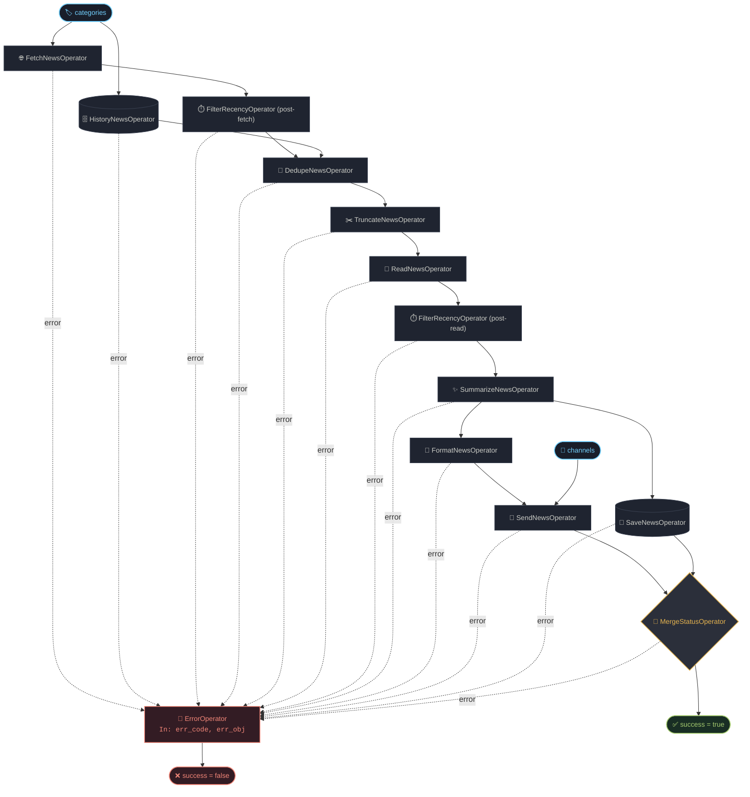

# News Briefing

An automated, AI-powered news briefing and summarization pipeline built with TypeScript and Node.js. 

It periodically gathers news across multiple categories, filters fresh stories, deduplicates against past coverage using AI, extracts article contents in parallel worker threads, synthesizes high-quality summaries with LLMs, and broadcasts formatted digests directly to Telegram channels.

---

## Architecture & Workflow

The pipeline is orchestrated by a lightweight Directed Acyclic Graph (**LightDAG**) engine where each step is an isolated, strongly-typed **Operator**.



---

## Key Features

- **Multi-Category Ingestion:** Supported categories include `international`, `football`, `realmadrid`, `f1`, `ai`, `mlb`, `shenzhen`, and `tabletennis`.
- **True Parallel Processing:** Uses [Piscina](https://github.com/piscinajs/piscina) worker threads for CPU and I/O intensive web scraping (`fetch` and `read`).
- **Two-Stage Smart Deduplication:**
  1. *Exact ID Matching:* Quickly eliminates known historical hashes from PostgreSQL.
  2. *AI Semantic Matching:* Detects multi-source duplicates and tracks event development stages, keeping only the freshest, most informative updates.
- **Multilingual AI Summarization:** Generates concise, journalistic headlines and substantive bullet points in your selected language (English, Chinese, Spanish, Japanese, etc.).
- **Telegram Broadcasting:** Formats messages into clean Telegram `MarkdownV2` syntax with auto-chunking (up to 4000 chars per message).
- **Scheduled or One-Off Execution:** Run once directly via CLI or keep running as a background service via integrated Cron scheduling.
- **Robust Error Handling:** Catches and isolates errors at each DAG node, routing failures to dedicated error channels without crashing silent loops.

---

## Directory Structure

```
.
├── Dockerfile                # Production container specification
├── docker-compose.yml        # Docker Compose configuration (App + DB)
├── init.sql                  # PostgreSQL database initialization script
├── package.json              # Project scripts and dependencies
├── tsconfig.json             # TypeScript compiler settings
├── example.env               # Environment configuration template
└── src/
    ├── main.ts               # One-shot CLI runner
    ├── cron_main.ts          # Scheduled Cron runner
    ├── news_briefing.dag.ts  # DAG pipeline assembly
    ├── run.ts                # Pipeline execution wrapper
    ├── light-dag/            # Core DAG engine (Operator, DAG runner)
    ├── operators/            # Pipeline step definitions
    │   ├── common/           # Error structures and shared utilities
    │   └── workers/          # Piscina worker threads (_fetch.ts, _read.ts)
    ├── types/                # Enums, entities, and Zod schemas
    └── utils/                # Database context, OpenAI client, Telegram, Config
```

---

## Getting Started

### Prerequisites

- **Node.js**: `v20.x` or `v22.x+`
- **PostgreSQL**: `v16+` / `v17+`
- **OpenAI / Compatible LLM API Key**
- **Telegram Bot Token** (from [@BotFather](https://t.me/botfather))

### Installation

1. **Clone the repository:**
   ```bash
   git clone <repo-url>
   cd news_briefing
   ```

2. **Install dependencies:**
   ```bash
   npm install
   ```

3. **Configure Environment Variables:**
   Copy the template and edit your secrets:
   ```bash
   cp example.env .env
   ```

---

## Configuration Reference

Edit `.env` (or pass environment variables) to customize the pipeline:

| Variable | Required | Default | Description |
| :--- | :---: | :---: | :--- |
| `database_host` | Yes | `localhost` | PostgreSQL host |
| `database_port` | No | `5432` | PostgreSQL port |
| `database_user` | Yes | — | PostgreSQL username |
| `database_password` | Yes | — | PostgreSQL password |
| `database_name` | Yes | — | PostgreSQL database name |
| `ai_api_key` | Yes | — | API key for OpenAI or compatible provider |
| `ai_base_url` | Yes | — | Base URL for LLM provider (e.g. `https://api.openai.com/v1`) |
| `ai_model` | Yes | — | Model identifier (e.g. `gpt-4o-mini`, `gpt-4o`, `claude-3-5-sonnet`) |
| `ai_timeout` | No | `300000` | AI request timeout (ms) |
| `ai_max_retries` | No | `3` | AI request retry count |
| `telegram_token` | Yes | — | Telegram Bot token |
| `categories` | Yes | — | Comma-separated categories: `international, football, realmadrid, f1, ai, mlb, shenzhen, tabletennis` |
| `channels` | Yes | — | Comma-separated target Telegram chat/channel IDs |
| `language` | No | `English` | Output language: `English`, `Chinese`, `Spanish`, `French`, `German`, `Italian`, `Portuguese`, `Russian`, `Japanese`, `Korean` |
| `filter_recency_td_hours` | No | `24` | Maximum age of news in hours |
| `history_time_window_days` | No | `3` | Lookback window (days) for historical deduplication |
| `send_parse_mode` | No | `MarkdownV2` | Telegram parse mode (`MarkdownV2`, `HTML`, `Markdown`) |
| `send_chunk_size` | No | `4000` | Max character length per Telegram message |
| `error_channels` | No | `""` | Comma-separated channel IDs for fatal error alerts |
| `cron_expr` | Required for Cron | — | 5-field cron expression (e.g. `0 8,12,18,22 * * *`) |
| `time_zone` | No | `UTC` | Timezone for cron schedule & date headers |
| `dag_timeout` | No | `900000` | Overall DAG execution timeout (ms) |
| `debug` | No | `false` | Enable verbose DAG and operator logging |

---

## Usage

### 1. Run a Single News Briefing (One-Shot)

Run the full pipeline once and exit:

```bash
# Using tsx directly
npx tsx src/main.ts

# Or with custom config file
CONFIG_PATH=./src/test.env npm test
```

### 2. Run Scheduled Cron Service

Run the application as a continuous background daemon using the schedule in `cron_expr`:

```bash
# Using tsx
npx tsx src/cron_main.ts

# Or with test script
CONFIG_PATH=./src/test.env npm run test_cron
```

---

## Production Build & Deployment

### Local Production Build

To compile TypeScript and prepare the distribution artifacts:

```bash
npm run build
```

This compiles TypeScript into `build/dist/` and copies all necessary production files (`Dockerfile`, `docker-compose.yml`, `package.json`, `package-lock.json`, `.env`, `init.sql`) into the `build/` directory.

### Running with Docker Compose

1. Build the release package:
   ```bash
   npm run build
   ```

2. Start the service and database:
   ```bash
   cd build
   docker compose up -d --build
   ```

3. View live container logs:
   ```bash
   docker compose logs -f news_briefing
   ```

4. Stop services:
   ```bash
   docker compose down
   ```

---

## Development & Testing

- **Type Checking:**
  ```bash
  npx tsc --noEmit
  ```
- **Operator Details:**
  For deep technical specs on each pipeline operator (inputs, outputs, concurrency models, and error codes), see the [Operators Reference](file:///root/source/news_briefing/src/operators/README.md).

---

## License

ISC
